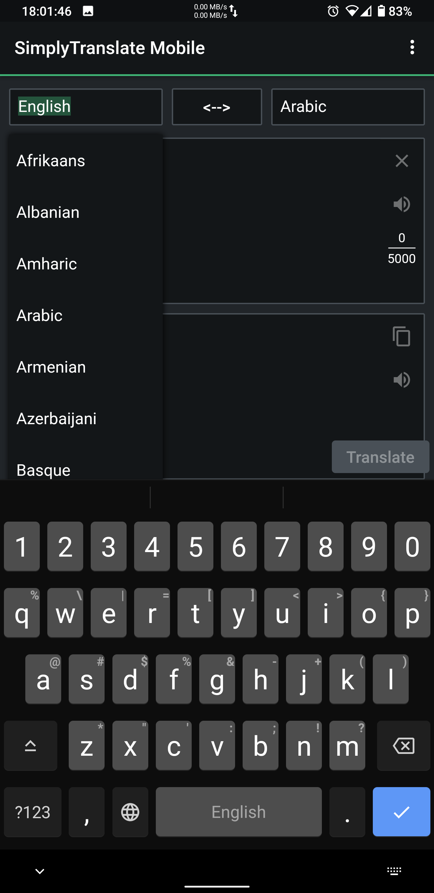
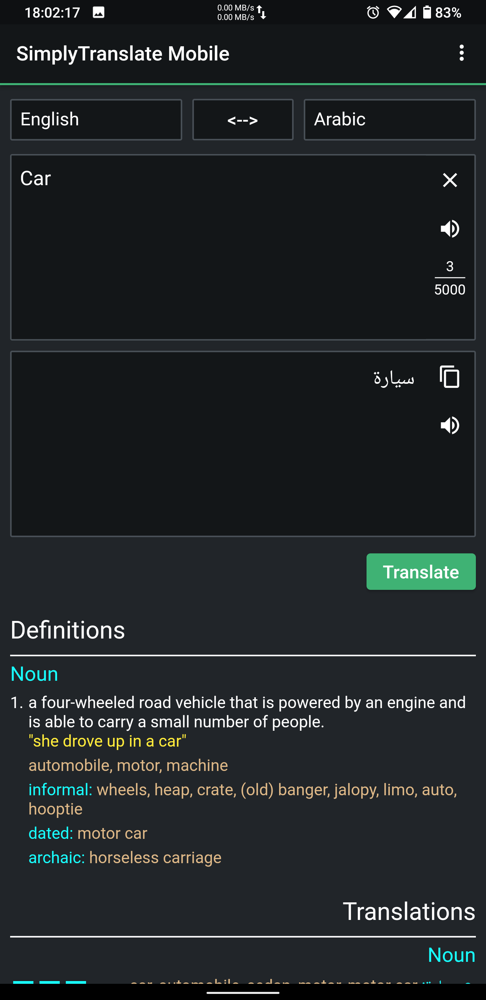
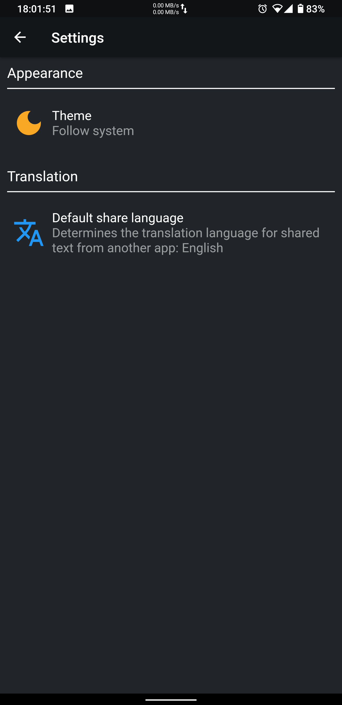

  

<h1 align=center>SimplyTranslate Mobile</h1>

<h4 align=center>A privacy friendly frontend to Google Translate</h4>

  

&nbsp;
&nbsp;
&nbsp;

## Download beta debug versions
Download the most recent **Artifact** from the [Actions](https://github.com/ManeraKai/simplytranslate_mobile/actions) page. You should be logged in before you're able to download.

## Contributing
I use [VSCodium](https://vscodium.com/). I use the extensions [Dart](https://marketplace.visualstudio.com/items?itemName=Dart-Code.dart-code) and [Flutter](https://marketplace.visualstudio.com/items?itemName=Dart-Code.flutter). The Dart one has an auto-formatter. Please use this setup to prevent unnecessary formatting changes.

If you've inherited this project, keep in mind that there are some python scripts in `scripts/` that process translated strings for both website and app.

To compile translations run `dart run build_runner build`

## Translation
Weblate: https://hosted.weblate.org/projects/simplytranslate-mobile/
