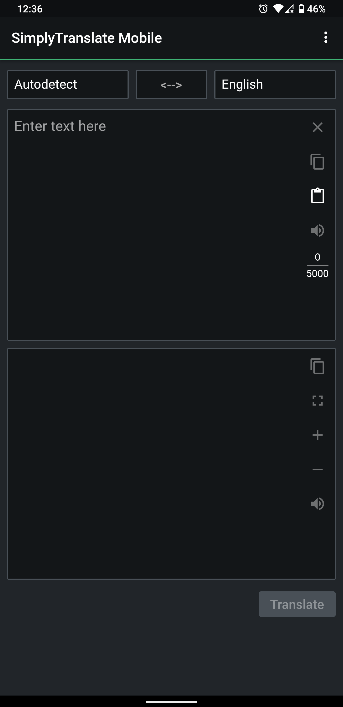
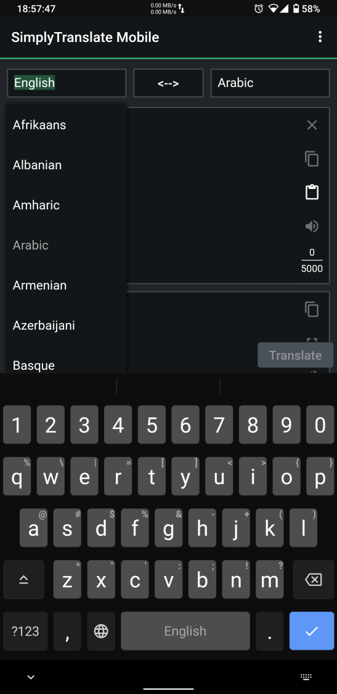
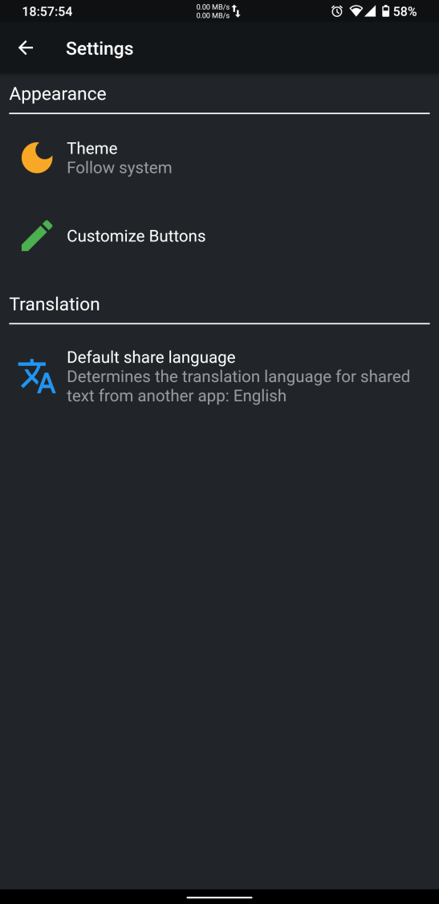
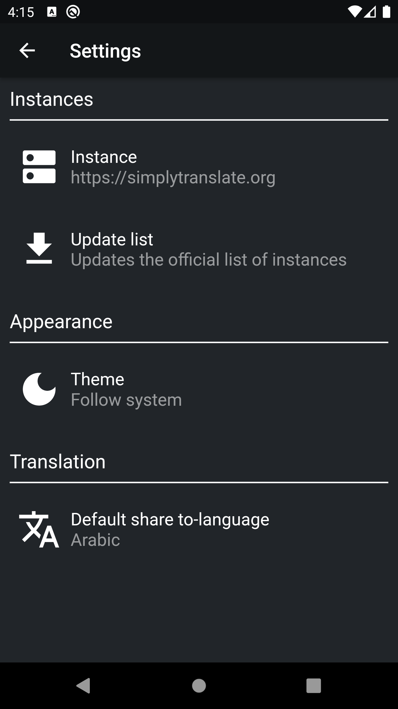
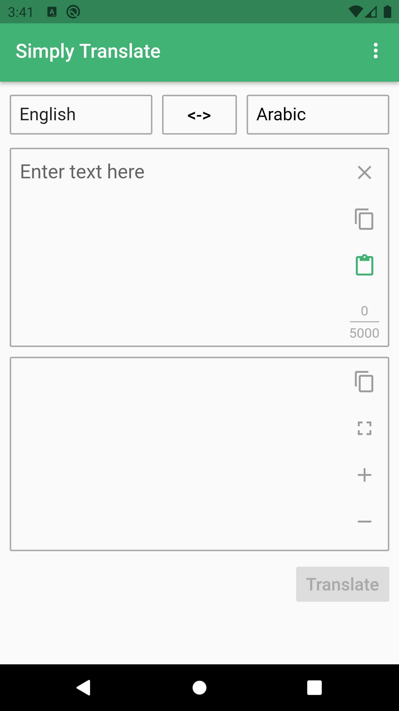
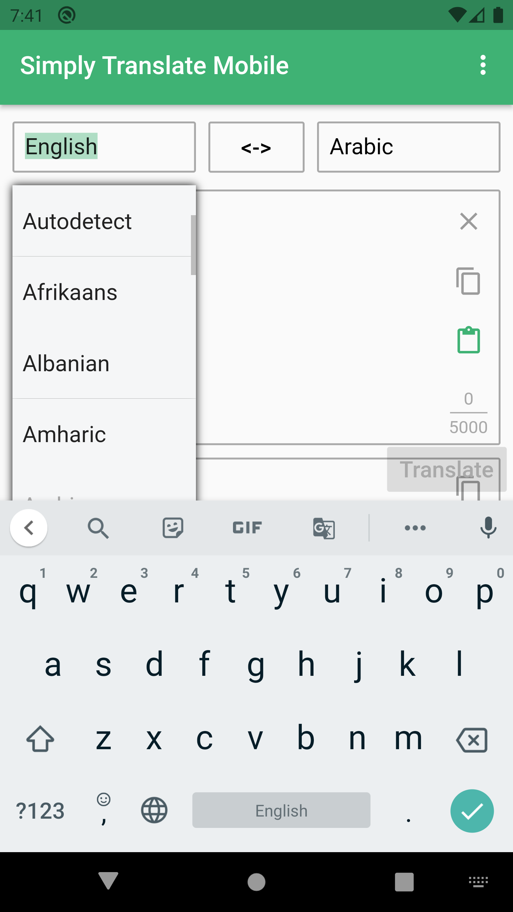
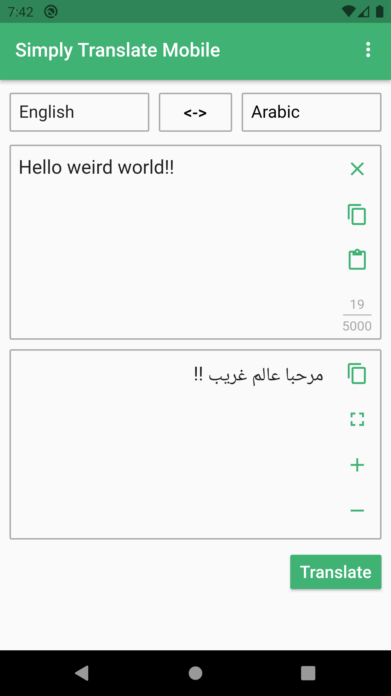

  

<h1 align="center">SimplyTranslate Mobile (Unofficial)</h1>

<h4 align="center">An unofficial mobile client that connects to multiple <a href="https://simplytranslate.org/">SimplyTranslate</a> instances.</h4>

  

## 🖼 Screenshots

&nbsp
&nbsp
&nbsp
&nbsp
&nbsp
&nbsp

## ⬇ Download
Via F-Droid: [com.simplytranslate_mobile](https://f-droid.org/en/packages/com.simplytranslate_mobile/).

For the most up-to-date versions. Download the most recent **Artifact** from the [Actions](https://github.com/ManeraKai/simplytranslate_mobile/actions) page. They may be slow as they're in debug-mode. You should login before you'll be able to download.

## 🌐 Translation
1. Copy the [English translation file](https://github.com/ManeraKai/simplytranslate_mobile/blob/main/lang/main_en.arb).
2. Translate it to your language.
3. Add your new translated file to [this directory](https://github.com/ManeraKai/simplytranslate_mobile/blob/main/lang/) with name: **main_[$langCode](https://developers.google.com/admin-sdk/directory/v1/languages)**.arb

We appreciate it!

## 👨‍🔧 Contributers

### Testers
- [Valdnet](https://github.com/Valdnet)

### Translators

- **🇵🇱 Polish:** [Aga-C](https://github.com/Aga-C), [Valdnet](https://github.com/Valdnet)
- **🇸🇦 Arabic**: [ManeraKai](https://github.com/ManeraKai)
- **🇮🇳 Malayalam:** [sunilpaulmathew](https://github.com/sunilpaulmathew)
- **🇨🇳 Chinese, Hong Kong:** [CafeTango](https://github.com/CafeTango)
- **🇩🇪 German:** [metalune](https://metalune.xyz/)

## 🎨 Icon
The favicon is not ours and we didn't make it. It's for the original [SimplyTranslate](https://simplytranslate.org/) project and I took a permission from it's creator to make the app more familiar to users. The designer of the favicon is [joelchrono12](https://joelchrono12.ml/).

## 💲 Donation

 - [Liberapay](https://liberapay.com/simplytranslate_mobile)

We really appreciate it!

## 📄 License
Copyright (C) 2021 ManeraKai

This program is free software: you can redistribute it and/or modify it under the terms of the GNU General Public License as published by the Free Software Foundation, either version 3 of the License, or (at your option) any later version.

This program is distributed in the hope that it will be useful, but WITHOUT ANY WARRANTY; without even the implied warranty of MERCHANTABILITY or FITNESS FOR A PARTICULAR PURPOSE. See the GNU General Public License for more details.

You should have received a copy of the [GNU General Public License](https://www.gnu.org/licenses/) along with this program.
